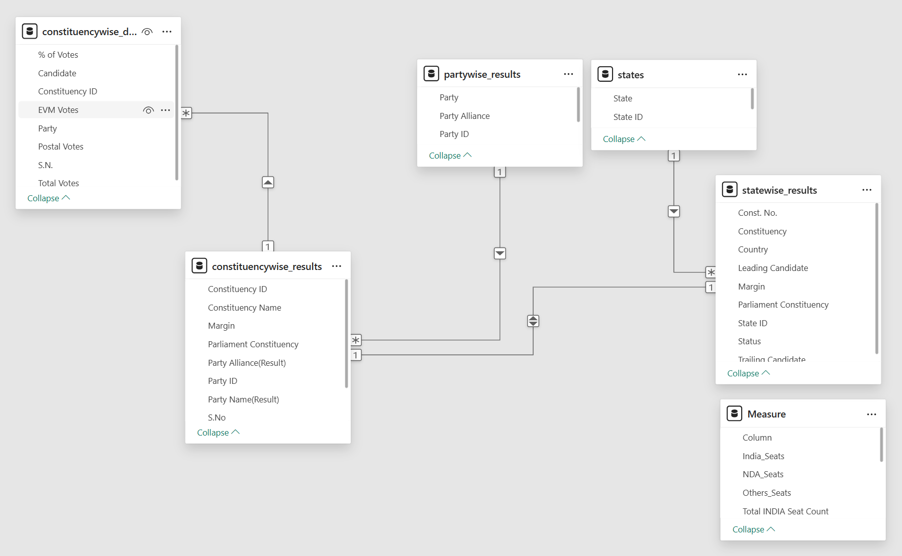

## 📂 About the Dataset

#### The data is derieved from Election Commision of India website.

### Dataset Tables

#### Constituencywise_results.csv
Purpose: Stores the final election outcome for each Lok Sabha Constituency and serves as the primary fact table in the the data model.

Key Use Cases
- Winning Candidate Analysis.
- Seat Distribution Analysis.
- Alliance performance tracking.
- Victory Margin Analysis.

Key Fields
- Constituency ID
- Parliment Constituency
- Winning Candidate
- Party ID
- Total Votes

---

#### Constituencywise_details.csv
Purpose: Contains detailed vote-level information for every candidate who contested in the constituency.

Key Use Cases
- Candidate performance analysis.
- Runner-up analysis.
- Vote share calculations.

Key Fields
- Candidate Name
- Party
- EVM Votes
- Postal Votes
- Total Votes

---

#### partywise_results.csv
Purpose: Store the total number of seats won by each political party.

Key Use Cases
- Party-wise seat share analysis
- Alliance contribution analysis

Key Fields
- Party ID
- Party
- Won
- Party Short Name (Calculated Column)
- Party Alliance (Calculated Column)

---

#### statewise_results.csv
Purpose: Provides election results aggregated at state level.

Key Use Cases
- State-wise political analysis
- Alliance dominance evaluation
- Regional performance comparison

Key Fields
- State ID
- Constituency
- Parliament Constituency

---
#### states.csv
Purpose: Dimension table containing state and union territory information.

Key Use Cases
- Geographic reporting
- State-level aggregation
- Map visualizations

Key Fields
- State ID
- State Name

### Data Model

The model follows a star schema like structure and is built around constituencywise_results as a central fact table which connects to partywise_results, statewise_results, and constituencywise_details to suppourt analysis from national level seat distribution down to individual candidate performance.

#### Relationship overview

States -> Statewise_results
- Connected through State ID 
- One state can have multiple constituencies.
- Used for state-level analysis and map visualization.

Statewise_results -> Constituencywise_results
- Connected through 'Party ID'.
- One party can win in multiple constituencies.
- Used for alliance and party-wise analysis.

Constituencywise_results -> Constituencywise_details
- Connected through 'Constituency ID'.
- One contituency can contain multiple candidates.
- Enables candidate-level vote analysis, vote share calculation and runner-up comparisons.

With this data model you can find out the following:
- National Level (Party and Alliance performance)
- State Level (Political dominance)
- Constituency Level (Election Outcomes)
- Candidate Level (Vote Share & Margins)

